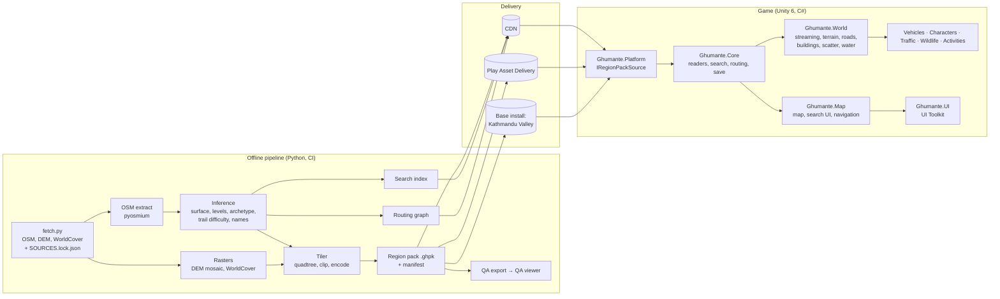

# Ghumante: architecture

> Status: **M0 draft, 2026-10-04.** This is a living document. Decisions are tagged with an ADR number (§13) so code comments can refer to them.
> Companion docs: [ROADMAP](ROADMAP.md) · [PROGRESS](PROGRESS.md) · [DATA_FORMATS](DATA_FORMATS.md) · [LICENSES](LICENSES.md) · [ASSET_MANIFEST](ASSET_MANIFEST.md) · [OSM tag coverage](reports/tag_coverage.md) ([findings](reports/TAG_COVERAGE_FINDINGS.md)) · [Landmark check](reports/landmarks.md)

---

## 1. Summary

Ghumante is a mobile open-world explorer of the real Nepal. Three parts make it up:

1. **An offline data pipeline** (`/pipeline`, Python). It turns OpenStreetMap, Copernicus GLO-30 elevation and ESA WorldCover land cover into deterministic, quadtree-tiled **region packs**, plus a **search index** and a **routing graph** per region. It runs on a dev machine or in CI, never on a phone.
2. **An engine-agnostic C# core** (`game/Assets/Ghumante/Core`, no `UnityEngine` references). It holds coordinates, data readers, search, routing, save schema and gameplay rules. This is the part we can unit-test anywhere with plain `dotnet test`.
3. **A Unity 6 LTS + URP game** (`/game`). It streams the region packs into a cartoon world around the player: terrain, roads, procedural buildings, scattered vegetation, water, traffic, wildlife. It also provides the vehicles, activities, the map and search, saves, and the UI from the reference image.

Everything rests on **canonical real-world coordinates**: the game world is derived from them by a scale model, so no persistent data ever depends on how we squash Nepal.

---

## 2. Where this brief needs pushback

The brief is strong. Twelve points need a change, a decision from you, or a caveat before we commit. The ones marked **Decision** need your answer (collected in §14).

| # | Topic | What the brief says | Concern | Recommendation |
|---|---|---|---|---|
| P1 | **World scale** | Evaluate 1:1 vs uniform compression | At 1:1, Kathmandu to Pokhara is about 200 km of road, roughly 2 h of real-time riding, and Lukla to EBC is about 65 km of trail. Uniform compression (1:4 to 1:10) breaks towns: real building footprints and 5 m roads cannot shrink, so Thamel stops fitting. | **Variable scale, "Euro Truck Simulator style"** (§5): towns stay at 1:1, open country is compressed about 1:6, and slopes and view angles are preserved. M0/M1 build the valley at 1:1 (identity warp). The warp is a separate pipeline stage, with a go/no-go gate before M2. **Decision**: target travel times. |
| P2 | Memory budget and frame rate | "~1.5 GB on low-end (3–4 GB RAM)"; "60 fps on iPhone 12 and Snapdragon 7-series" | 1.5 GB equals the *lowest* cap of Android 17's new Memory Limiter on a 3 GB phone (½ of RAM), and Play vitals starts enforcing memory thresholds in Feb 2027. iPhone 12 apps are killed at about 2.1 GB. Snapdragon 7 Gen 1 and 7s Gen 2 have **less than half** the iPhone 12's GPU throughput (3DMark Wild Life ~3 000 vs ~7 500). | **Peak budgets: 3 GB Android ≤ 1.0 GB, 4 GB Android ≤ 1.5 GB, 4 GB iPhone ≤ 1.4 GB, 6 GB+ ≤ 2.0 GB** (§10). **60 fps** on iPhone 12 / A14+ and Snapdragon 7 Gen 3+. **30 fps by default, with a 60 fps option**, on SD 7 Gen 1 / 7s Gen 2, until device profiling proves 60 is sustainable. |
| P3 | Nepali text | "Full UI localization in English and Nepali from day one" | Devanagari needs OpenType shaping (conjuncts, reordered vowel signs, reph). Unity's TextMeshPro/uGUI does not shape Indic scripts. Shaping exists only in UI Toolkit's Advanced Text Generator (§7.9). | Build all UI in **UI Toolkit with the Advanced Text Generator**. A week-1 spike checks Devanagari on real devices. If the spike fails, fall back to a HarfBuzz-based shaping plugin. |
| P4 | OSM reality | Real surfaces, real buildings | The [coverage report](reports/tag_coverage.md) shows that **85% of road length has no `surface`**, **99.6% of 8.3 M buildings have no `building:levels`**, 97.5% are plain `building=yes`, `sac_scale` covers 2% of trails, and `name:ne` is on only 14–29% of villages and hamlets. | Treat **inference as the main path**: surface, levels, archetype, trail difficulty and Nepali names are all modelled, and every inferred value is flagged. "Accurate" becomes "true where OSM knows, plausible and consistent where it doesn't". The QA viewer shows which is which. |
| P5 | Install size and delivery | PAD + On-Demand Resources | **ODR is deprecated as of iOS 27.** Apple-hosted Background Assets need iOS 26+, and about 21% of iPhones were not on iOS 26 in June 2026. Most of our region data is our own random-access binary format, not Unity assets. | **Region packs are plain files behind one `IRegionPackSource` interface.** The **CDN is the baseline on both platforms**: Cloudflare R2 has no egress fees. PAD (Android) and Apple-hosted Background Assets (iOS 26+) are optional backends that save hosting cost. The base install, including the Kathmandu Valley pack, stays **≤ 150 MB** so it is under the 200 MB cellular prompts. |
| P6 | Licensing (ODbL) | Attribution in credits and on the map | Our tiles are a *Derivative Database* that we distribute inside the app. ODbL 4.4/4.6 then requires us to offer the derived database **or the method used to make it**. | Publish the pipeline (at least the transformation method) under an open licence, keep hand-curated content (fun facts, curated gems) in a separate database, and attribute on every map screen and in the credits. **Lawyer review needed** (see LICENSES.md). **Decision**. |
| P7 | Real business names | Real POIs, generic shopfronts | OSM `shop`/`amenity` names are real businesses, some with trademarks. Painting them on signs or listing them in search invites trademark and endorsement problems. | Shopfronts use generic Nepali-style signage. Search covers public places (temples, peaks, lakes, squares, transport hubs, viewpoints) and hotels and teahouses only where they are trek landmarks. |
| P8 | M3 scope | Annapurna + Everest, trekking, Lukla flight, helicopter, glaciers, yaks and horses, bungee | That is three milestones of work: two new biomes, two new movement systems, an aircraft system, and a mini-game. | Split it into **M3a** (Annapurna, trekking, stamina, horses) and **M3b** (Everest, the Lukla flight, helicopter, glaciers, bungee). See ROADMAP. |
| P9 | "Every milestone installable on a phone" | — | Unity cannot run in this cloud dev environment, and CI builds need a **Unity licence seat**, an **Apple Developer account** with signing assets, and a **Play Console** account. | The CI is wired up with GameCI and fastlane. You add the secrets listed in `docs/CI_SECRETS.md`. Until then, milestone builds come from your machine. **Decision**: Unity tier. |
| P10 | Cultural accuracy | Respectful depiction | Some sites have real access rules: non-Hindus may not enter Pashupatinath's main temple, and photography rules vary. | Model the real access rules (the inner sanctum is not enterable; the player watches aarti from the east bank) and add them to the cultural review list. |
| P11 | Kid-appropriate + analytics | Opt-in where required | A game that appeals to children brings COPPA, GDPR-K and the Play Families policy. Ad and analytics SDKs are the usual problem. | Collect no analytics by default, leave out ad SDKs, use a privacy-first crash reporter, and target a 9+ / PEGI 7 rating. |
| P12 | Engine | Unity 6 LTS default | "Unity 6 LTS" is now two lines. 6.0 LTS reaches end of support **this month (Oct 2026)**. **6.3 LTS (6000.3.x)** is supported to Dec 2027. 6.7 LTS (the last Mono-based release) is in beta, and Unity 7 (CoreCLR) follows in 2027. Godot 4.7 still marks C# on Android and iOS as experimental. | **Unity 6.3 LTS** (§3). Keep core C# free of Mono-specific APIs so the 6.7 and Unity 7 migrations stay cheap. |
| P13 | Rivers from HydroSHEDS | Optional data source | The HydroSHEDS v1 / HydroRIVERS licence (WWF EULA: flow-down, anti-decompile, termination at will) conflicts with publishing our database under ODbL. | **Drop it.** Rivers come from OSM waterways, plus DEM flow accumulation if needed (LICENSES §1.4). |
| P14 | Mirror data has personal metadata | — | The working OSM mirror (geo2day) includes contributor names, uids and changesets. Geofabrik's public extract strips them. | Strip metadata at ingest, and never emit it (LICENSES §1.1). |
| P15 | Disputed border | — | Nepal's official 2020 map includes Kalapani–Lipulekh–Limpiyadhura, which India disputes. The in-game map's border is a legal and market decision. | **Decision** (LICENSES §4). |

---

## 3. Engine decision (ADR-001)

**Decision: Unity 6.3 LTS (6000.3.x, latest patch 6000.3.25f1, supported to Dec 2027) with URP, Forward renderer**, for the reasons below. We re-evaluate a move to 6.7 LTS a few patches after it ships, and Unity 7 (CoreCLR) is a 2027+ migration. The facts and their sources are in the [research appendix](#appendix-a-verified-platform-facts).

| Criterion | Unity 6 LTS | Godot 4.x | Weight |
|---|---|---|---|
| Large-world mobile rendering (instancing, GPU-driven, occlusion, LOD tooling) | Mature: SRP Batcher, BatchRendererGroup, GPU Resident Drawer, LOD Group, Burst-compiled jobs | Workable (MultiMesh, visibility ranges), but fewer shipped open-world mobile titles and no Burst equivalent: C++ GDExtension is needed for heavy procedural generation | High |
| Procedural generation throughput | Burst + Jobs + Collections on a worker pool, with near-native speed from C# | GDScript/C# are slower; C++ GDExtension adds a second toolchain | High |
| Delivery (PAD/ODR/CDN) | First-party Play Asset Delivery support; Addressables with remote catalogs | Community plugins only | Medium |
| Devanagari shaping | UI Toolkit Advanced Text Generator only; TextMeshPro cannot shape it | HarfBuzz text server built in | Medium. Mitigated by building the UI in UI Toolkit (P3) |
| C# on mobile | Production (IL2CPP) | **Experimental** on Android and iOS in Godot 4.7; iOS export only from macOS | High |
| Large worlds | Double-precision core data, floating origin (ours) | Double precision requires custom-compiled editor and export templates | Medium |
| Profiling and device tooling | Profiler, Memory Profiler, Frame Debugger, Adaptive Performance | Profiler, plus RenderDoc and Xcode/AGI externally | Medium |
| Cost and licence | Personal is free below the revenue/funding threshold; Pro seat above it | MIT, free | Medium. **Your decision on tier** |
| CI headless builds | Needs licence activation (GameCI), and macOS for iOS | No licence; runs anywhere | Low |
| Asset ecosystem (toon shaders, vehicles, animals) | Very large | Small | Medium |

**Mitigations that keep the door open:** the pure-C# core (§7.1) has no engine dependency. All data is in our own documented formats. Rendering code goes through a small set of interfaces (`ITerrainRenderer`, `IInstancedRenderer`, `IRoadMesher`). A port would replace the `Ghumante.World` and UI assemblies, not the game.

---

## 4. System overview



---

## 5. Coordinates, projection and world scale

### 5.1 Coordinate frames (ADR-002)

| Frame | Definition | Used for |
|---|---|---|
| Geographic | WGS84 lon/lat | Source data, map UI, debug teleports, fun facts |
| **Canonical (NPL-TM84)** | `+proj=tmerc +lat_0=0 +lon_0=84 +k=0.9996 +x_0=500000 +y_0=0 +ellps=WGS84`: a UTM-style Transverse Mercator on the 84°E meridian, which is exactly the boundary between UTM zones 44N and 45N | All persistent positions (saves, discoveries, pins, search entries). True metres. |
| **Game** | `warp(canonical) − (100 000, 2 900 000)`; X east, Z north, Y up | Everything in the scene |

* Scale error of NPL-TM84 over Nepal: **0.9996 on 84°E to 1.0018 at the eastern border** (measured with PROJ in `projection.scale_factor_at`). That is at most 1.8 m per km, which is invisible in play.
* After the origin shift, all of Nepal has positive game coordinates: X ≈ 18–818 km, Z ≈ 16–470 km (identity warp). That fits inside the 2^20 m quadtree root.

### 5.2 Floating origin (ADR-003)

`float32` has about 6 cm resolution at 800 km, which causes visible jitter. The runtime therefore uses:

* `WorldPos` (`double` X/Z, `float` Y) in the core for every persistent and simulation position.
* A **floating origin**: the scene is rebased when the player is more than 2 km from the current origin. All root transforms, particle systems, the physics world and the streaming caches are shifted together in one frame, and listeners (`IOriginShiftListener`) get the delta. Physics runs in local floats near the origin.
* Tile content is built relative to the tile origin and placed at `tileOrigin − floatingOrigin`, so meshes are never rebuilt when the origin moves.

### 5.3 World scale (ADR-004)

Some numbers to frame the decision (real-world figures are in Appendix A):

| Journey | Real distance | 1:1 (arcade speeds) | **Option 3 (recommended)**: towns 1:1, country ~1:6 | Option 4: "compact", places 1:4, corridors 1:20 |
|---|---|---|---|---|
| Thamel → Boudhanath | 4.9 km straight, ~6 km road | ~5 min by motorbike | ~5 min (urban, 1:1) | ~1.2 km, about 1 min |
| Kathmandu → Pokhara (Naubise–Pokhara is 174 km of Prithvi Hwy) | ~200–210 km | ~2 h | **~15–20 min** | ~10 km, about 7 min |
| Lukla → Everest Base Camp | ~65 km trail (36.7 km straight) | ~6–8 h walking | **~60–80 min**, in stages | ~3.3 km, about 25 min walking |
| Kathmandu → Sauraha (Chitwan) | ~165 km | ~1.5 h | ~15 min | ~8 km |
| Kathmandu Valley area | ~650 km² | 650 km² | ~250–400 km² | ~40 km² (about half of Forza Horizon 4) |

Precedents (Appendix A): Euro Truck Simulator 2 and American Truck Simulator use **1:20** outside cities (primary source; ATS was rescaled from 1:35 in 2016) and about **1:3** in cities (secondary source). The Crew squeezed the USA into about 5 000 km² for a ~90 min coast-to-coast drive. Forza Horizon 4 and 5 maps are about 72 and 107 km². Microsoft Flight Simulator is 1:1 because it flies.

**Options considered**

1. **1:1 everywhere.** This is the simplest and the most faithful, and the map is exact. But long journeys are tedious, and the game would lean almost entirely on fast travel. That works against the vision of going anywhere, any way. It also gives the largest world to fill and the biggest download.
2. **Uniform compression (1:4–1:10).** Rejected. Real footprints, 5 m roads and human-sized props cannot shrink, so towns become unreadable and roads overlap.
3. **Variable scale (recommended).** Settlement cores stay at 1:1, peri-urban areas and valley floors run at about 1:2, and open country at **about 1:6** (tunable per region between 1:4 and 1:8). Smooth transitions connect them. **Real streets and building footprints survive in towns**, which is the brief's core promise ("everything is where it really is"), while the road trips between towns shrink to a fun length.
4. **Compact, ETS-style** (proposed by our scale research): places at 1:4, corridors at 1:20, a separate vertical of about 1:6–1:8 (slopes exaggerated 2.5–3×). This makes a dense Forza-like world and the smallest downloads. But towns can no longer use real footprints and street grids. They become *typified*: a recognisable layout with selected landmarks and generated streets. That gives up "real roads, real villages", and makes searching for an arbitrary village much less meaningful. **Not recommended**, but it is the right choice if the priority is pacing over fidelity. **This trade-off is your call (§14 Q1).**

**How the variable scale works (pipeline stage `warp.py`, M2)**

* **Scale field.** `s(x)` ∈ [1/8, 1] is computed on a 500 m canonical grid from settlement density (OSM buildings plus the WorldCover built-up class), then heavily smoothed. Gradients are limited so no building is noticeably sheared.
* **Horizontal warp.** We solve for an *as-similar-as-possible* map φ, in which each grid cell becomes a scaled and rotated copy of itself with local scale `s(x)`. This is a sparse linear least-squares problem, solved once for all of Nepal (about 0.5 M unknowns at 1 km resolution). It is stored as a displacement grid plus its inverse, both shipped to the device so the runtime can convert lon/lat ↔ game.
* **Vertical model.** Elevation is split as `z = B + r`: `B` is a heavily low-passed base (σ ≈ 15 km) and `r` is local relief. Game height is `z' = k_b·B + s(x)·e(z)·r`. Here `k_b` is the base compression (about 1/6), so the valley floor (~1 350 m) and the Terai (~100 m) keep their relative order without fake tilts. `s(x)` makes slopes in compressed areas a *similarity*, so **slopes and the angular size of distant peaks are preserved**: the Himalaya look exactly as tall from the hills as in reality. `e(z)` is an optional "drama" exaggeration of 1.0–1.4 above 3 000 m. Everest stands about 800 m above Base Camp in game, which is enormous next to a 1.7 m character.
* **Road generalisation.** Compression would turn hairpin stacks into knots. A cartographic generalisation pass simplifies them, enforces a minimum turning radius (12 m), cuts the number of bends in a stack, checks gradients, and carves the terrain corridor. This is the single biggest risk of the scale model, so it is a **go/no-go gate before M2** (see ROADMAP).
* **Settlement typification.** Dispersed hill-village houses in compressed zones are thinned and re-placed (keeping one house in *k*), using the same building data.
* **Fallback** if the gate fails: stay 1:1, and add *journey mode* (auto-drive along the real route with points of interest to stop at) plus generous fast travel.

Saves, discoveries and the search index store canonical coordinates, so changing the scale model never invalidates player progress (ADR-002).

---

## 6. Offline data pipeline

### 6.1 Stages

| Stage | Module | Input → output | Notes |
|---|---|---|---|
| Fetch | `fetch.py` | Mirrors → `data/raw/**`, `SOURCES.lock.json` | Geofabrik first, then the OSMToday mirror. MD5 checked for OSM; SHA-256 recorded for everything; resumable. |
| Coverage | `coverage.py` | PBF → `docs/reports/tag_coverage.{md,json}` | Run nightly; CI warns when coverage drops. |
| Landmarks | `landmarks.py` | PBF + `config/landmarks.yaml` → `landmarks.resolved.json` | Hero placement source of truth. |
| Extract | `osm_extract.py` | PBF + region bbox → `Extract` (`model.py`) | pyosmium with node locations; multipolygons via the area assembler; clipped to bbox + buffer. |
| Tag parsing | `tags.py` | raw tags → typed fields | Robust to Nepali data quirks: `G+2` levels, `5m`, `5 m`, `bitumin`, `Blacktopped`, Hebrew `בלתי_סלול` and so on. |
| Surface inference | `surface.py` | Roads → surface + source | Empirical model trained on the 15% of roads that are tagged (§6.2). |
| Building inference | `buildings.py` | Buildings → levels, height, roof, materials, archetype | Rules from region, density, use and elevation. Configurable. |
| Trail difficulty | `trails.py` | Paths + DEM → `sac_scale` (inferred where missing) | Slope, altitude, glacier proximity. |
| Rasters | `dem.py`, `landcover.py` | COG tiles → seamless samplers in game space | Bilinear for 30 m+ spacing; pre-filtered (area-averaged) for coarse LODs. |
| Biomes | `biomes.py` | WorldCover + OSM land use + elevation + slope + region → `Biome` | Terraces = cropland on slopes of 8–35° in the middle hills. |
| Tiling | `tiling.py` | Everything → `GHT1` tiles | Clipping with context points; buildings by centroid; areas triangulated. |
| Packing | `pack.py` | Tiles → `.ghpk` + manifest | Deterministic, CRC per tile. |
| Search | `translit.py`, `search_index.py` | Places, POIs, landmarks → `.ghsi` | Latin, Devanagari, romanised Nepali, fuzzy. |
| Routing | `routing.py` | Roads and trails → `.ghrg` | Per-profile access and speeds. |
| QA export | `qa_export.py` | Pack → GeoJSON + PNGs | Decodes the pack, so it tests the whole chain. |

`build.py --region kathmandu_valley` runs every stage. Each stage caches its output under `build/cache/<region>/<stage>-<hash>.pkl.gz`. The hash covers stage inputs, config and code version, so editing the biome rules does not re-read the 468 MB PBF.

### 6.2 Inference models (ADR-005)

Coverage numbers come from the [tag coverage report](reports/tag_coverage.md).

* **Road surface** (85% of length untagged). This is an empirical conditional distribution P(surface group | highway class, settlement-density bin, elevation bin, terrain-slope bin), fitted on the tagged roads of the same build with Laplace smoothing. It backs off to coarser conditioning when counts are thin, and finally to hand priors (trunk/primary → asphalt; track → dirt). `tracktype` and `smoothness` are used first when present (`DERIVED`). The model picks the arg-max when its probability is ≥ 0.6. Otherwise it samples deterministically, using a hash of the *road chain* (the same name+ref, or connected ways of the same class), so one road does not change surface every 100 m. Tagged vs inferred percentages go into the manifest and the coverage report.
* **Building levels and height** (99.6% unknown). Levels are drawn from a distribution chosen by archetype and urban density: Kathmandu core 3–5 levels, peri-urban 2–4, hill villages 1–2, Terai 1–2. The deterministic per-building seed makes the result stable.
* **Archetype.** In order: religious tags first; then hand-drawn polygons (`config/archetype_zones.yaml`: Newar old towns, Sherpa Khumbu, the trans-Himalaya); then elevation and region rules; then density.
* **Trail difficulty** (`sac_scale` on 2% of trails). Inferred from slope percentile along the path, maximum altitude, and glacier or moraine proximity.
* **Nepali names** (missing on most villages). The order is `name:ne`, then `name` when it is Devanagari, then *no* machine transliteration in the UI (we show the Latin name). We do not show machine-made Devanagari to Nepali readers. The romaniser is used only for search keys.

### 6.3 Terrain and road conformance

DEM heights are shipped at 8 m spacing on level-10 tiles (129² samples per 1 024 m). The runtime builds 2 m near-field terrain chunks by bicubic upsampling and conforms them to roads: it flattens the road corridor along the road's smoothed elevation profile with a falloff, and adds embankments and cuts. This happens in Burst jobs, so the pack stays small and roads always sit on the terrain.

### 6.4 Determinism and reproducibility

* For the same inputs (pinned by `SOURCES.lock.json`), config and code, the pipeline produces byte-identical packs. A CI test builds the fixture region twice and compares SHA-256 sums.
* `data_version` is written into every tile, pack and manifest. The runtime refuses to mix packs with different `data_version` values.
* The nightly job re-fetches data, rebuilds every region, publishes the coverage report and a diff, and uploads packs to the staging CDN. Production promotion is a manual step.

### 6.5 QA viewer

`tools/qa-viewer/` is a static Leaflet page. It shows OpenStreetMap tiles underneath, and the decoded pack layers (roads coloured by surface and by `surface_source`, buildings by archetype, areas, POIs, hillshade and biome PNGs) on top, plus a tile-grid overlay and click-to-inspect attributes. It is developer-only. It respects the OSM tile usage policy (low volume, attribution shown), and it can switch to a self-hosted basemap.

---

## 7. Runtime architecture (Unity)

### 7.1 Assemblies

| Assembly | Engine refs | Responsibility |
|---|---|---|
| `Ghumante.Core` | **none** (`noEngineReferences`) | `WorldPos`, NPL-TM84 projection, tile keys, `GHT1`/`GHPK`/`GHSI`/`GHRG` readers, search, routing (A*), travel profiles, save schema and migrations, localisation keys, service interfaces (`IAnalytics`, `ICrashReporter`, `ICloudSave`, `IQuestService`, `IDialogueService`), event bus |
| `Ghumante.World` | Unity, Burst, Collections, Mathematics | Streaming, floating origin, terrain, roads, buildings, scatter, water, sky, weather |
| `Ghumante.Vehicles` | Unity | Arcade vehicle controller, surface grip table, vehicle definitions (ScriptableObjects) |
| `Ghumante.Characters` | Unity | Player controller (walk, run, climb, stamina), NPCs, crowds |
| `Ghumante.Traffic` | Unity | Lane graph built from `ROAD`, traffic agents, cows, horn logic |
| `Ghumante.Wildlife` | Unity | Biome spawn tables, behaviour state machines, photo targets |
| `Ghumante.Activities` | Unity | `IActivity` framework, one sub-folder per activity |
| `Ghumante.Map` | Unity | Vector map renderer, fog of discovery, search UI, route display, minimap |
| `Ghumante.UI` | Unity (UI Toolkit) | Menus and HUD in the reference style, localisation binding |
| `Ghumante.Save` | Unity (I/O only) | Local save storage, cloud-save adapters |
| `Ghumante.Audio` | Unity | Adaptive music layers, biome ambience |
| `Ghumante.Platform` | Unity | Region delivery (`IRegionPackSource`: PAD, CDN, built-in), Game Center / Play Games, device tier detection |
| `Ghumante.DebugTools` | Unity | Teleport, overlays, OSM tag inspector, FPS/memory HUD, weather/time override (development builds only) |
| `Ghumante.App` | all | Bootstrap, scene flow, dependency wiring |

Dependencies only point downward toward `Core`. Gameplay assemblies talk to each other through `Core` interfaces and the event bus, never directly.

### 7.2 World streaming

* **LOD rings** sit around the camera's position in tile space, with radii in metres per tier:

  | Ring | Tile level | Content | Low | Mid | High |
  |---|---|---|---|---|---|
  | Near | 10 (1 km) | full: terrain 8 m data refined to 2 m near the camera, roads, buildings kit LOD0–1, scatter, traffic | 0.75 km | 1.25 km | 1.75 km |
  | Mid | 9 (2 km) | terrain 16 m, simplified roads, buildings as merged extrusions, impostor trees | 2.5 km | 4 km | 6 km |
  | Far | 8 (4 km) | terrain 32 m, major roads, building blocks | 6 km | 10 km | 14 km |
  | Horizon | 5–7 | terrain only; skyline impostor ring beyond | to 50 km | to 80 km | to 120 km |

* **Pipeline:** `TileRequest → IO thread (read pack range) → decode job (Core readers) → mesh-build jobs (Burst) → main-thread upload (budgeted)`. Main-thread work is capped at **2 ms per frame** (1.5 ms at 60 fps), spread over a queue ordered by distance and view direction.
* **Caches:** decoded tiles go in an LRU sized per tier, and meshes are pooled and reused.
* **Determinism:** all procedural variation comes from `SEED` and per-building `seed`, so the world is identical on every visit and on every device.

### 7.3 Terrain

Terrain uses chunked LOD in the CDLOD style. Each tile builds a regular grid mesh, and vertices **morph** toward the parent LOD in the transition band, so there is no popping and no cracks. Skirts cover any remaining T-junction gaps. Shading is a toon ramp: biome colours come from a palette texture indexed by `BIOM`, with triplanar noise for detail and slope-based rock blending.

### 7.4 Roads

Road meshes are ribbons generated from `ROAD` polylines. Width comes from the tag or a class default, and the cross-section from surface and class. Junctions are found from shared endpoints and given simple polygon caps. Bridges get deck meshes. Surface sets the material (asphalt, brick and so on), the physics material (§7.6), the decals (potholes, puddles in monsoon) and the particles (dust, mud). Trails are narrow ribbons with stone steps on `steps`.

### 7.5 Buildings

* **Archetype grammars.** Each archetype in `BuildingArchetype` is a ScriptableObject: a facade grammar (ground floor, upper floors, trims), a roof generator per `RoofShape`, a palette, and modular kit pieces (walls, windows, doors, trims), with the toon material per archetype. A footprint is split into facades; facades are filled from the kit, chosen by seed, levels and use.
* **LOD.** LOD0 is the kit, built in the near ring and GPU-instanced per piece. LOD1 is one merged extruded mesh per tile, with roof shapes. LOD2 is per-block merged boxes with the facade texture atlas.
* **Landmarks.** OSM buildings flagged `LANDMARK` are hidden, and the hand-made hero prefab is placed at the resolved OSM location (`landmarks.resolved.json`) and orientation.

### 7.6 Vehicles and physics

The vehicle model is an arcade raycast-wheel controller. Grip, top speed, drag and camera shake come from `SurfaceGroup` × weather: the monsoon makes `DIRT` act like `MUD`. Stuck vehicles recover automatically after 3 seconds (a bounce and a nudge), so mud is never a soft-lock. Vehicle access follows the travel profile masks (`Travel`). A bus physically cannot enter a footpath: the road is too narrow, and a friendly "the bus can't go there" prompt appears.

### 7.7 Traffic, pedestrians, animals

* **Traffic.** A lane graph is built per tile from `ROAD`. Density comes from road class and time of day, scaled by tier. Agents give way to cows: a cow is a static obstacle with a soft avoidance radius, and vehicles never collide with animals (there is a damage-free bump plus a stop).
* **Pedestrians.** Crowds use GPU-skinned or vertex-animation-texture instancing in dense areas. Archetypes include porters with doko baskets, monks, sadhus and kids flying kites (Dashain).
* **Wildlife.** Spawn tables are keyed by `Biome` and region (rhino only in Chitwan and Bardiya). Behaviour is a state machine (wander, graze, flee, flock, perch). Interaction is observation only: the photo system scores framing and distance.

### 7.8 Map, search and navigation

* **Map.** The map renders vectors from `ROAD`/`AREA`/`LINE`/`POIS` at the zooms that need detail. For country and province zoom it uses a precomputed generalised map layer (M2). The style is cartoon: thick outlines and a paper texture. Undiscovered areas use a sketch style through a fog-of-discovery mask texture, which is updated as the player explores and saved as a compressed bitmap.
* **Search.** The C# search port matches the Python reference (`search_index.py`). Golden tests run the same query list in both languages and compare the ranked results.
* **Routing.** A* over `GHRG` per travel profile gives an ETA per mode. *Go there yourself* draws a route ribbon in the world and on the minimap, with turn hints from the edge geometry. *Fast travel* is allowed to discovered places and transport hubs, with a cartoon transition.

### 7.9 UI and localisation

* **UI Toolkit for every screen.** The reason is Devanagari shaping (P3): UI Toolkit's Advanced Text Generator uses HarfBuzz and ICU. uGUI and TextMeshPro are not used for text.
* **Style.** The reference style is built as USS: cream panels, ribbon headers, glossy pill buttons with a darker bottom edge, round icon buttons, and counter pills with a "+".
* **Fonts.** Baloo 2 for display (Latin + Devanagari) and Mukta for body text. Both are SIL OFL 1.1. See LICENSES.md.
* **Localisation.** The Unity Localization package provides EN and NE string tables. Nepali numerals (०-९) are a per-locale option. Every string has a key, and CI fails on missing keys in either table.

### 7.10 Save system

* Local JSON saves, compressed, with `schemaVersion` and ordered migrations (`ISaveMigration`). Writes are atomic: write to a temp file, then rename. Two rotating backups are kept.
* Sections: `player` (canonical position, vehicle), `discovery` (fog bitmaps per region, found POIs, passport stamps), `collections`, `progress` (explorer level, coins, stars), `settings`, `story` (reserved, empty), `quests` (reserved, empty).
* `ICloudSave` gets Game Center and Play Games Services implementations later. Conflicts resolve by merging collections and taking the maximum of progress.

### 7.11 Story Mode hooks

`IQuestService`, `IDialogueService`, `IWorldStateFlags`, `INpcRegistry`, and save sections `story` and `quests` exist in M1, each with a no-op implementation. Activities and discoveries publish events (`DiscoveryMade`, `ActivityCompleted`, `PlaceEntered`) that a quest system can subscribe to later.

### 7.12 Analytics, crash reporting, privacy

`IAnalytics` and `ICrashReporter` are interfaces. The default `NullAnalytics` collects nothing. Analytics is enabled only after explicit opt-in, and never for players who declare an age under 13 (or 16 in the EU). There are no ad SDKs. Choosing a crash reporter is left to M1 (candidates: Unity Cloud Diagnostics, Sentry, Crashlytics). It must be configurable to collect no personal data.

### 7.13 Debug tools

Debug tools ship in development builds only. They include: teleport to coordinates, a place name or a tile; a tile and LOD overlay; a "nearest OSM feature" inspector that shows the original tags and the inferred fields with their sources; an FPS, frame-time and memory HUD; time-of-day and weather override; streaming statistics; and a fast-forward travel mode.

---

## 8. Rendering style

* **Toon lighting.** A URP custom lit shader (Shader Graph plus a custom function) with a ramp texture, rim light and optional inverted-hull outlines (characters, vehicles and landmarks only, for cost reasons).
* **Atmosphere.** The sky gradient and stylised height fog make distant ranges fade into a soft blue. Snow peaks keep a warm rim at sunrise and sunset; this is the hero moment.
* **Skyline.** Beyond the horizon tiles, a 360° skyline impostor ring is precomputed per region from the coarse DEM, so the Himalaya are always on the horizon.
* **Animation.** Vertex-shader wind (trees, prayer flags), squash-and-stretch on characters and vehicles, and bouncy UI tweens.
* **Weather.** Clear, valley fog, monsoon rain with wet-surface shader parameters and puddles, and snow at altitude. A wetness value drives road physics.

---

## 9. Delivery and install size (ADR-008)

* **Base install ≤ 150 MB on both stores.** That keeps it below the 200 MB thresholds where Play shows a mobile-data warning and iOS asks for cellular permission. It is well inside Play's current 500 MB base-module and 4 GB install-time limits, and Apple's 4 GB app limit. It contains: the code, UI, shared art kits, a coarse whole-Nepal overview (map layer plus the national search index), and the **Kathmandu Valley pack** (target ≤ 60 MB).
* **Region packs** are plain binary files (`.ghpk`, `.ghsi`, `.ghrg` plus a manifest), read with random access. Per-region **Addressables bundles** carry the hero art (landmarks, region-specific kits). Both sit behind one `IRegionPackSource`:
  * `BuiltInSource`: the base region in StreamingAssets. On Android, StreamingAssets live inside the compressed APK and cannot be seeked, so the pack is copied once to persistent storage on first launch and verified by SHA-256.
  * `CdnSource` (**baseline on both platforms**): HTTPS with resume, a SHA-256 manifest, content-hashed immutable URLs with long cache headers, and versioned catalogs that keep N−1 live. Before downloading, the app shows the size and recommends Wi-Fi with an explicit cellular opt-in (App Store guideline 4.2.3(ii)). It supports pause, resume and **delete region**. Hosting is Cloudflare R2, which has no egress fees, or Unity CCD.
  * `PlayAssetDeliverySource` (optional, Android): an on-demand pack per region (≤ 1.5 GB each; up to 100 packs; 30 GB total on demand). Hosting is free, but packs over 200 MB on mobile data need the consent dialog (`showConfirmationDialog`).
  * `AppleHostedAssetsSource` (optional, iOS 26+): Apple-hosted Background Assets through Apple's official Unity plug-in (WWDC26). It is free (200 GB, 200 packs), but every pack version goes through App Review. It is not usable as the only path while iOS 16–25 devices matter. **On-Demand Resources are not used**, because they are deprecated as of iOS 27.
* Downloaded regions **work fully offline**. Packs are validated on launch, and a corrupt or evicted pack is re-downloaded.
* **Store policy:** packs contain only data, with no native code, managed assemblies or scripts. That is allowed under App Store Review Guideline 2.5.2 and Play's Device and Network Abuse policy (Appendix A).

---

## 10. Performance and memory budgets

Tiers are detected at first launch from total RAM, GPU name and graphics API, and refined by a 10-second frame-time probe. The player can override the tier. Adaptive Performance (built into the engine since Unity 6.3) uses Android ADPF and iOS `ProcessInfo.thermalState` to step down resolution and frame rate when the device gets hot. 60 fps modes are designed for about 10–11 ms of GPU time, because phones throttle to about 75% of peak in sustained play.

| Budget | **Low**: 3–4 GB Android (Helio G85/G99, Unisoc T606; Mali-G52/G57) | **Mid**: Snapdragon 7 Gen 1 / 7s Gen 2 (Adreno 644/710), 6–8 GB | **High**: iPhone 12 / A14+, Snapdragon 7 Gen 3+ and 8-series |
|---|---|---|---|
| Target frame rate | 30 fps, render scale 0.7 | 30 fps default, 60 fps option | **60 fps**, dynamic resolution, 30 when thermal is serious |
| CPU main thread | ≤ 22 ms | ≤ 14 ms (30) / 9 ms (60) | ≤ 9 ms |
| SRP batches (estimate; validate on device) | ≤ 120 | ≤ 200 | ≤ 300 |
| Visible triangles (estimate) | ≤ 150 k | ≤ 400 k | ≤ 700 k |
| **Peak memory footprint** | **≤ 1.0 GB** (3 GB phone), ≤ 1.3 GB (4 GB phone) | ≤ 1.5 GB | ≤ 1.4 GB (4 GB iPhone; jetsam kills at about 2.1 GB), ≤ 2.0 GB (6 GB+) |
| — textures (mipmap streaming budget) | 200 MB | 350 MB | 450 MB |
| — meshes | 100 MB | 180 MB | 250 MB |
| — decoded tile cache | 30 MB | 60 MB | 90 MB |
| — managed heap | 100 MB | 140 MB | 180 MB |
| — audio | 25 MB | 40 MB | 50 MB |
| Near ring radius | 0.75 km | 1.25 km | 1.75 km |
| NPCs / vehicles nearby | 25 / 12 | 60 / 30 | 120 / 50 |
| Shadows | blob + 1 cascade, 512 | 1 cascade, 1024 | 2 cascades, 1024 |
| Outlines | landmarks only | characters, vehicles, landmarks | + props |

* **Renderer:** URP **Forward**, not Forward+, which is markedly slower on Android Vulkan (Unity issue UUM-40387). SRP Batcher on. Static batching for building chunks. GPU instancing or a custom BatchRendererGroup for vegetation and props; both work on GLES. **GPU Resident Drawer** and GPU occlusion culling need Forward+ and do not run on GLES, so they are an opt-in experiment on High only, adopted only if device profiling shows a net gain.
* **Graphics APIs:** Vulkan with GLES 3.x fallback on Android (about 11% of handhelds lack Vulkan 1.1+), Metal on iOS. Textures are ASTC only: 6×6 for terrain and building albedo, 8×8 far or Low, 4×4 for UI and faces. Mipmaps are disabled on UI. Read/Write is never enabled.
* **Memory discipline:** Unity keeps grown native and managed heaps, so peaks during tile transitions are what trigger kills. Resident tiles are hard-capped per tier, tiles are evicted *before* loading new ones, and meshes are pooled. iOS polls `os_proc_available_memory()` and drops a tier below 400 MB free. Android records `ApplicationExitInfo` (`MemoryLimiter:AnonSwap`).
* **Release gates:** user-perceived LMK rate < 1%; P90 foreground memory ≤ 75% of the Play vitals threshold (games on 4 GB: 2.25 GB); a 20-minute soak on one reference device per tier.

---

## 11. Build, CI/CD and environments

| Workflow | Trigger | What it does |
|---|---|---|
| `pipeline.yml` | push, PR | Run `pytest`, including a synthetic end-to-end build done twice to check byte-determinism and seams. |
| `core.yml` | push, PR | Regenerate golden files from the Python reference and check they are committed unchanged, then `dotnet test` for `Ghumante.Core` against them. |
| `unity.yml` | push to main, manual | GameCI (`unityci/editor` 6000.3.x images): EditMode tests, Android AAB (IL2CPP, ARM64, **targetSdk 36**, minSdk 29, 16 KB page support), iOS Xcode project, then macOS + fastlane → TestFlight. It skips cleanly without secrets (`docs/CI_SECRETS.md`). |
| `localization.yml` | push, PR | Fails when a string key is missing in EN or NE. |
| `nightly-data.yml` | cron 02:15 UTC | Fetch, coverage report, landmark check, build all active regions, upload artifacts and the staging CDN, and post a diff summary. |

`ProjectSettings` are applied by an editor script (`Ghumante.EditorTools.ProjectSetup`), not edited by hand. That covers the bundle id, API levels, IL2CPP, ARM64, graphics APIs and the URP asset. The script is idempotent, so CI and every developer get identical settings.

---

## 12. Repository layout

```
/docs                 architecture, roadmap, progress, formats, licences, reports
/pipeline             Python data pipeline (pyproject.toml)
  /config             regions, sources, landmarks, archetype zones, inference priors
  /ghumante_pipeline  package
  /tests              pytest (unit, fixture end-to-end, real-data marked)
  fetch.py build.py   CLI entry points
/shared               cross-language contracts (enums.json, golden files)
/core-tests           dotnet test project compiling Ghumante.Core sources outside Unity
/game                 Unity 6 project
  /Assets/Ghumante/{Core,World,Vehicles,...}
/tools/qa-viewer      static web QA viewer
/.github/workflows    CI
```

---

## 13. Decision log (ADRs)

| ADR | Decision | Status |
|---|---|---|
| 001 | Unity 6.3 LTS + URP (Forward), engine-agnostic C# core | Accepted (§3) |
| 002 | Canonical CRS NPL-TM84; persistent data in canonical/lon-lat only | Accepted |
| 003 | Floating origin, rebase at 2 km; doubles in core | Accepted |
| 004 | Variable-scale world (towns 1:1, country ~1:6) via an ASAP warp; identity in M0/M1; go/no-go before M2 | **Proposed: needs your sign-off on target travel times** |
| 005 | Inference-first data model with per-field provenance flags | Accepted |
| 006 | Own binary formats (GHT1/GHPK/GHSI/GHRG), DEFLATE, deterministic builds | Accepted |
| 007 | UI Toolkit for all UI (Devanagari shaping); TMP not used for text | Accepted, pending the device spike |
| 008 | Region packs via `IRegionPackSource` (PAD / CDN / built-in / Apple-hosted later) | Accepted |
| 009 | No analytics by default; no ad SDKs | Proposed |
| 010 | OSM shop/brand names not rendered in-world, not searchable | Proposed |
| 011 | Quadtree root 2^20 m, leaf level 10 (1 024 m), heights 129² at 15 cm quantisation | Accepted |
| 012 | Source independence: mirror list in `sources.yaml`, MD5 + SHA-256 lock file | Accepted |
| 013 | Layer separation: OSM features, DEM-derived and WorldCover-derived data are kept in separate chunks; curated content in a separate DB (ODbL collective-database posture) | Accepted, pending lawyer review |
| 014 | No HydroSHEDS/HydroRIVERS (licence conflict); rivers from OSM | Accepted |
| 015 | Base install ≤ 150 MB; CDN as the baseline delivery path; PAD and Apple-hosted packs optional; no ODR | Accepted |

---

## 14. Open questions for you

1. **World scale** (ADR-004, §5.3): Option 3 (real towns at 1:1, country ~1:6; Kathmandu → Pokhara ≈ 15–20 min) or Option 4 (compact 1:4 / 1:20; ≈ 7 min, but typified rather than real towns)? Or what target travel times would you like?
2. **Unity licence tier and accounts**: Personal (≤ $200k revenue + funding) or Pro? Who owns the Apple Developer and Play Console accounts that CI will sign with?
3. **ODbL approach** (P6): are you OK publishing the pipeline source (or at least the transformation method) and offering the derived database? Do you have a lawyer for the review in LICENSES §6?
4. **Disputed border** (P15): which map of Nepal does the game show, and does that change per store region?
5. **Frame-rate promise** (P2): do you accept 30 fps by default on Snapdragon 7 Gen 1 / 7s Gen 2-class phones (with a 60 fps option), and 60 fps on iPhone 12 / SD 7 Gen 3+?
6. **Economy mapping**: Coins (rentals, tickets, cosmetics), Stars (discoveries and medals), Hearts/Energy as in-world stamina only. Should Stars unlock regions at all, or only badges and cosmetics?
7. **Monetisation direction** (later): cosmetics and/or region packs? This affects whether region downloads are free and which delivery backend pays for hosting.
8. **Art direction**: should outlines be on everything or only on hero objects? Should the palette follow the reference image exactly or lean more pastel?
9. **Cultural consultant**: do you have someone in mind? We need them before the M1 hero landmarks are final.
10. **Minimum iOS**: keep iOS 16, or raise it to 17 if A11 devices (iPhone 8/X) can't hold the Low budget?

---

## Appendix A: verified platform facts (research pass 2026-10-04)

Each line is a checked fact with its source. The full research notes, including medium- and low-confidence items, are in `docs/reports/research_2026-10-04.md`.

**Engine**
* Unity 6.3 LTS (6000.3) is supported until Dec 2027. The latest patch is 6000.3.25f1 (2026-09-24). Unity 6.0 LTS support ends Oct 2026. — [unity.com/releases/unity-6/support](https://unity.com/releases/unity-6/support)
* Unity Personal is free up to $200k revenue + funding. Pro costs $2 310 per seat per year from 2026-01-12. The Runtime Fee was cancelled 2024-09-12. Personal may disable the splash screen in Unity 6. — [unity.com/en/products/pricing-updates](https://unity.com/en/products/pricing-updates), [unity.com/blog/unity-is-canceling-the-runtime-fee](https://unity.com/blog/unity-is-canceling-the-runtime-fee)
* Godot 4.7.2 is the latest stable release. Godot docs still describe C# on Android and iOS as experimental, and double precision needs custom-built templates. — [godot-docs c_sharp](https://raw.githubusercontent.com/godotengine/godot-docs/4.7/tutorials/scripting/c_sharp/index.rst)
* The URP GPU Resident Drawer needs Forward+ and does not run on OpenGL ES. — [docs.unity3d.com 6000.3 GPU Resident Drawer](https://docs.unity3d.com/6000.3/Documentation/Manual/urp/gpu-resident-drawer.html)
* GameCI publishes `unityci/editor` images for 6000.3.25f1 (android and ios). Building iOS needs macOS for Xcode and signing. — [game.ci iOS](https://game.ci/docs/github/deployment/ios)

**Stores and delivery**
* Google Play limits: base module 500 MB; asset pack 1.5 GB; 4 GB for base plus install-time; 30 GB for on-demand and fast-follow; a 200 MB mobile-data warning. — [support.google.com/googleplay/android-developer/answer/9859372](https://support.google.com/googleplay/android-developer/answer/9859372)
* New apps and updates must **target API 36** from 2026-08-31. 16 KB page support is required for updates from 2027-02-01. — [developer.android.com target-sdk](https://developer.android.com/google/play/requirements/target-sdk)
* On-Demand Resources are deprecated in iOS 27. Managed and Apple-hosted Background Assets need iOS 26+, with 200 GB and 200 packs, and every pack goes through App Review. — [ODR limits](https://developer.apple.com/help/app-store-connect/reference/app-uploads/on-demand-resources-size-limits), [AssetPackManager](https://developer.apple.com/documentation/backgroundassets/assetpackmanager), [Apple-hosted limits](https://developer.apple.com/help/app-store-connect/reference/app-uploads/apple-hosted-asset-pack-size-limits)
* iOS 26 was on 79% of active iPhones (June 2026). — [developer.apple.com/support/app-store](https://developer.apple.com/support/app-store/)
* App Store 2.5.2 bans downloading code that changes features. 4.2.3(ii) requires disclosing the size of a required download. Play bans downloading executable code from outside Play. — [App Review Guidelines](https://developer.apple.com/app-store/review/guidelines/), [Play policy](https://support.google.com/googleplay/android-developer/answer/9888379)

**Performance and memory**
* Android 17's Memory Limiter caps visible apps at ½–⅔ of RAM. Play vitals memory thresholds for games on 4 GB devices are 2.25 GB foreground and 2.00 GB background, and they affect store visibility from Feb 2027. — [source.android.com memory-limiter](https://source.android.com/docs/core/perf/memory-limiter), [Android vitals](https://developer.android.com/topic/performance/vitals)
* iPhone 12 (4 GB) jetsam kills reported at "ActiveHard 2098 MB". This is a community report, not a figure Apple publishes. — [Apple forums 688973](https://developer.apple.com/forums/thread/688973)
* 3DMark Wild Life medians: iPhone 12 about 7 545; SD 7 Gen 1 about 3 110; 7s Gen 2 about 3 014; 7 Gen 3 about 5 372; Helio G99 about 1 231; G85 about 720. — [benchmarks.ul.com](https://benchmarks.ul.com)
* Forward+ was markedly slower than Forward on Android Vulkan for screen-filling objects (UUM-40387, Won't Fix). — [issuetracker.unity.com](https://issuetracker.unity.com/issues/2480/gpu-frame-time-is-bad-on-android-vulkan-when-object-covers-a-lot-of-screen-pixels)

**Scale and geography**
* American Truck Simulator was rescaled from 1:35 to 1:20 in 2016, "equivalent to Euro Truck Simulator 2". — [blog.scssoft.com 2016/06](https://blog.scssoft.com/2016/06/)
* Prithvi Highway (NH17): Naubise–Pokhara is 174 km. Kathmandu–Sauraha is about 165 km. Lukla–EBC is about 65 km one way. Nepal's area is 147 516 km² (2020 map). Everest is 8 848.86 m. Nepal has 7 provinces, 77 districts, 753 local levels and 6 743 wards. — see the research notes for sources.
* OSM admin levels for Nepal: 4 = province, 6 = district, 7 = local level, 9 = ward. — [OSM wiki Template:Admin level](https://wiki.openstreetmap.org/wiki/Template:Admin_level)
