# Ghumante: roadmap

> Living plan. Each milestone ends with: **an installable build** (Android internal track + TestFlight, once CI secrets exist; see `CI_SECRETS.md`), **green automated tests**, and an updated [PROGRESS.md](PROGRESS.md).
> The size column is relative engineering effort (S < 2 wks, M 2–4 wks, L 4–8 wks for one engineer plus art support). It is a rough guide, not a commitment.

Changes from the brief, with reasons in [ARCHITECTURE §2](ARCHITECTURE.md#2-where-this-brief-needs-pushback):

* M3 is split into **M3a** (Annapurna and trekking) and **M3b** (Everest and air).
* **Gates** are added: technical go/no-go checkpoints where we stop and decide.
* M1 adds a **device text-shaping spike** (Devanagari) in its first week.

```mermaid
gantt
  dateFormat  X
  axisFormat %s
  section Foundations
  M0 Foundations            :m0, 0, 3
  section Vertical slice
  M1 Kathmandu Valley       :m1, after m0, 8
  Gate G1 scale warp        :milestone, g1, after m1, 0
  section Expansion
  M2 Kathmandu–Pokhara      :m2, after m1, 8
  M3a Annapurna & trekking  :m3a, after m2, 6
  M3b Everest & air         :m3b, after m3a, 6
  M4 Terai & wildlife       :m4, after m3b, 7
  M5 All of Nepal           :m5, after m4, 10
  M6 Polish & launch        :m6, after m5, 6
```

---

## M0: Foundations (planning and pipeline proof)

**Goal:** prove the data chain end to end for Kathmandu Valley, with the engine project and CI ready.

| Deliverable | Status | Notes |
|---|---|---|
| ARCHITECTURE, ROADMAP, LICENSES, PROGRESS, DATA_FORMATS, ASSET_MANIFEST | ✅ draft | Review the open questions in ARCHITECTURE §14 |
| OSM tag coverage report + findings | ✅ | `docs/reports/` |
| Hero landmark check against OSM | ✅ | 60/66 found |
| `fetch.py`: mirrors, checksums, lock file | ✅ | Geofabrik blocked from the cloud environment; mirror fallback |
| `build.py`: extract → infer → tiles → pack → search → routing → manifest | ✅ | See PROGRESS for stats |
| Pipeline tests (tags, surface inference, projection, seams, formats, search, routing, e2e determinism) | ✅ | `pytest` |
| QA viewer overlay on OSM | ✅ | `tools/qa-viewer` |
| Engine-agnostic C# core + golden cross-language tests | ✅ | `core-tests` |
| Unity 6 project skeleton, project setup + build scripts, UI Toolkit style + Devanagari spike screen | ✅ (unverified in Unity) | Needs a machine with Unity |
| CI workflows (pipeline, core, localisation, Unity Android/iOS, nightly data) | ✅ (Unity jobs need secrets) | `docs/CI_SECRETS.md` |

**Done when:** valley tiles match OSM in the viewer, and the seam, projection and determinism tests pass. ✔︎ for the data side. The two engine-side items need your Unity seat.

---

## M1: Vertical slice, Kathmandu Valley (size L, about 8 weeks)

**Goal:** search "Boudha" on a mid-range phone and ride a motorbike there along real roads at 60 fps.

| # | Work item | Size | Depends on |
|---|---|---|---|
| 1.1 | **Device spike, week 1:** UI Toolkit Advanced Text Generator renders the TextSpike screen correctly on iOS and Android. Pick the fallback if it doesn't. | S | Unity seat |
| 1.2 | Pack loading via `IRegionPackSource` (built-in), Core readers, tile cache, LOD rings, floating origin | M | M0 |
| 1.3 | Terrain: CDLOD chunks with morphing and skirts, biome palette toon shading, near-field road conformance (2 m) | M | 1.2 |
| 1.4 | Roads: ribbons, junction caps, surface materials, bridges; trails and steps | M | 1.2 |
| 1.5 | Buildings: Newar and Modern Urban grammars, kit LOD0, merged LOD1/2, landmark replacement | L | 1.2, art kit |
| 1.6 | Hero placeholders, then art: Boudhanath, Swayambhunath (monkeys), Kathmandu Durbar Square | M | ASSET_MANIFEST |
| 1.7 | Player: walk and run, motorbike, taxi; arcade physics; surface grip groups; stuck recovery | M | 1.4 |
| 1.8 | Traffic: lane graph, cars, bikes, buses on the real bus routes, **cows** (stop and steer, never harm), honking | M | 1.4 |
| 1.9 | Day/night cycle and sky; Himalayan skyline impostor ring; valley fog | M | 1.3 |
| 1.10 | Map: vector map of the valley, search (C# port, already golden-tested), route line, minimap, fast travel to discovered places | M | 1.2 |
| 1.11 | UI: main menu and HUD in the reference style (UI Toolkit), EN/NE localisation, settings, quality presets with auto-detect | M | 1.1 |
| 1.12 | Save system v1 (local), Story Mode hooks (no-op services) | S | Core |
| 1.13 | Debug tools: teleport, OSM inspector, overlays, perf HUD | S | 1.2 |
| 1.14 | Performance pass on iPhone 12 / Snapdragon 7-series and a 3 GB Android device | M | all |
| 1.15 | Cultural review of the M1 landmarks and depictions | S | consultant |

**Acceptance:** 60 fps median and 1% low ≥ 45 on Mid tier; 30 fps on Low; memory within budget (ARCHITECTURE §10); "Boudha" search → route → ride → arrive works; EN/NE complete.

### Gate G1: scale warp quality gate (end of M1, runs in parallel with M1 from week 4)

The scale model is **decided**: Option 3, towns at 1:1, the country compressed, and the map in true 1:1 geography (ARCHITECTURE ADR-004/016). G1 tunes the country compression ratio (default 1:6) and decides whether the road-generalisation quality is good enough to ship. It does not reopen the choice of model.

A prototype of `warp.py` on the Kathmandu–Pokhara corridor must meet all of these:

* No road self-overlaps after generalisation.
* Every hairpin is at least 12 m radius.
* Grades stay within vehicle limits.
* Building distortion in transition zones is under 5% (scale) and under 3° (rotation).
* The ride takes about 15–20 min.
* Testers prefer it to 1:1 + journey mode.

**If quality falls short:** soften the compression (for example 1:4) on the affected corridors, and use journey mode (auto-ride with stops) on the longest ones, rather than leaving road artefacts in.

---

## M2: Kathmandu → Pokhara (size L)

* The Prithvi Highway corridor with the scale warp live (towns 1:1, country compressed), Mugling, Bandipur, Manakamana cable car.
* The full-screen map in true 1:1 geography (canonical map layer, inverse-warped player marker and route).
* The middle-hills biome and **terraces**, chautari resting spots, rhododendron forests.
* Buses and painted trucks (the hero vehicle art), the long-distance bus experience, tempos.
* Pokhara: Phewa Lake, Tal Barahi, boating, Lakeside; the **Sarangkot paragliding** activity (thermals, eagles).
* First discoverables, the Explorer's Passport (district and province stamps from OSM admin levels 6 and 4), and fast travel with cartoon transitions.
* Region pack downloads (`CdnSource` + PAD) and offline verification.
* The generalised country map layer.

**Acceptance:** download Pokhara on demand, ride there from Thamel without a loading screen, paraglide off Sarangkot, and stamp the passport in Kaski district.

## M3a: Annapurna and trekking (size M–L)

* Trekking: teahouse stops, light altitude acclimatisation (Heart/Energy as in-world stamina), and pass celebrations with prayer flags, on the Poon Hill, Annapurna Base Camp and Annapurna Circuit routes from the OSM hiking relations.
* Horses and mules, the Mustang approach (Jomsom), Muktinath.
* High-mountain biome: blue pine, fir, juniper, yak pastures, mani walls, chortens.
* Trail difficulty uses the inferred `sac_scale`. Stamina and pace come from it.

## M3b: Everest and air (size L)

* Lukla STOL flight (a hero sequence), helicopter, scenic mountain flight.
* Khumbu: Namche, Tengboche, EBC, Kala Patthar, Gokyo; Sherpa architecture; glaciers, moraine, turquoise lakes.
* The Bhote Koshi bungee (the site needs hand placement; it is not in OSM).
* Yaks.

## M4: Terai and wildlife (size L)

* Chitwan and Bardiya jeep and canoe safari; the full wildlife system (rhino, tiger as a rare sighting, elephant, gharial, birds), with photo scoring.
* Lumbini (Maya Devi Temple, monastic zone), Janakpur (Janaki Mandir), Koshi Tappu.
* Terai and Tharu architecture, rickshaws, tempos; mustard and paddy fields.

## M5: All of Nepal (size XL)

* Every remaining region as an on-demand pack: Mustang and Lo Manthang, Rara, Phoksundo, Khaptad, the far west, the east (Ilam tea, Kalinchowk, Hyatung Falls).
* Complete collections and achievements; daily and weekly challenges.
* A performance pass across all device tiers, and a check that pack sizes fit store limits.

## M6: Polish and launch readiness (size L)

* Accessibility: colour-blind-safe UI, text size, control remapping, reduced motion.
* Localisation QA with native Nepali reviewers.
* Store compliance: privacy labels, data safety form, age rating, Families policy if applicable.
* Attribution screen (OSM, Copernicus, ESA) and ODbL offer.
* Fixes from the cultural review; legal sign-off on licences.

---

## Cross-cutting tracks (run continuously)

| Track | Owner | Notes |
|---|---|---|
| Art kit production per ASSET_MANIFEST | Art | Parallel to engineering from M1 |
| Data quality (OSM coverage, inference tuning, landmark edits) | Data | Nightly report diff |
| Cultural review list | Consultant | Grows with each milestone |
| Performance budget tracking | Engineering | Automated perf capture in CI on device farm (M2+) |
| Legal / licensing | You + lawyer | ODbL decision before M1 public build |
