# Ghumante: roadmap

> Living plan. Each milestone ends with: **an installable build** (Android internal track + TestFlight, once CI secrets exist; see `CI_SECRETS.md`), **green automated tests**, and an updated [PROGRESS.md](PROGRESS.md).
> The size column is relative engineering effort (S < 2 wks, M 2–4 wks, L 4–8 wks for one engineer plus art support). It is a rough guide, not a commitment.

Changes from the brief, with reasons in [ARCHITECTURE §2](ARCHITECTURE.md#2-where-this-brief-needs-pushback):

* M3 is split into **M3a** (Annapurna and trekking) and **M3b** (Everest and air).
* The world is **true 1:1** (product-owner decision, ARCHITECTURE §5.3). There is no scale warp, so the warp gate originally planned before M2 is gone.
* M1 adds a **device text-shaping spike** (Devanagari) in its first week.
* **Every real place, object, landmark, monument, scenery, winding road, waterfall, building, trekking route, forest and adventure spot in its actual place** (product-owner vision, 2026-10-05). [CONTENT_COVERAGE.md](CONTENT_COVERAGE.md) turns that into a measured contract. M1 grows by 1.16–1.23 plus a data track to honour it in the valley.

```mermaid
gantt
  dateFormat  X
  axisFormat %s
  section Foundations
  M0 Foundations            :m0, 0, 3
  section Vertical slice
  M1 Kathmandu Valley       :m1, after m0, 12
  section Expansion
  M2 Kathmandu–Pokhara      :m2, after m1, 8
  M3a Annapurna & trekking  :m3a, after m2, 6
  M3b Everest & air         :m3b, after m3a, 6
  M4 Terai & wildlife       :m4, after m3b, 7
  M5 All of Nepal           :m5, after m4, 10
  M6 Polish & launch        :m6, after m5, 6
```

---

## M0: Foundations (planning and pipeline proof)

**Goal:** prove the data chain end to end for Kathmandu Valley, with the engine project and CI ready.

| Deliverable | Status | Notes |
|---|---|---|
| ARCHITECTURE, ROADMAP, LICENSES, PROGRESS, DATA_FORMATS, ASSET_MANIFEST | ✅ draft | Review the open questions in ARCHITECTURE §14 |
| OSM tag coverage report + findings | ✅ | `docs/reports/` |
| Hero landmark check against OSM | ✅ | 60/66 found |
| `fetch.py`: mirrors, checksums, lock file | ✅ | Geofabrik blocked from the cloud environment; mirror fallback |
| `build.py`: extract → infer → tiles → pack → search → routing → manifest | ✅ | See PROGRESS for stats |
| Pipeline tests (tags, surface inference, projection, seams, formats, search, routing, e2e determinism) | ✅ | `pytest` |
| QA viewer overlay on OSM | ✅ | `tools/qa-viewer` |
| Engine-agnostic C# core + golden cross-language tests | ✅ | `core-tests` |
| Unity 6 project skeleton, project setup + build scripts, UI Toolkit style + Devanagari spike screen | ✅ (unverified in Unity) | Needs a machine with Unity |
| CI workflows (pipeline, core, localisation, Unity Android/iOS, nightly data) | ✅ (Unity jobs need secrets) | `docs/CI_SECRETS.md` |

**Done when:** valley tiles match OSM in the viewer, and the seam, projection and determinism tests pass. ✔︎ for the data side. The two engine-side items need your Unity seat.

---

## M1: Vertical slice, Kathmandu Valley (size L–XL, about 11–12 weeks)

**Goal:** search "Boudha" on a mid-range phone and ride a motorbike there along real roads at 60 fps.

| # | Work item | Size | Depends on |
|---|---|---|---|
| 1.1 | **Device spike, week 1:** UI Toolkit Advanced Text Generator renders the TextSpike screen correctly on iOS and Android. Pick the fallback if it doesn't. | S | Unity seat |
| 1.2 | Pack loading via `IRegionPackSource` (built-in), Core readers, tile cache, LOD rings, floating origin | M | M0 |
| 1.3 | Terrain: CDLOD chunks with morphing and skirts, biome palette toon shading, near-field conformance (2 m): benched road corridors from the `RPRF` profile, flat lakes, carved river channels, flattened runways | M | 1.2, D7, D8 |
| 1.4 | Roads: ribbons, hairpin arcs (≤ 1.5 m from the OSM line), junction caps, surface materials, bridge decks from `BRDG` (piers, railings, suspension-bridge greybox), trails and stone steps, L9/L8 road LOD; tunnel edges kept out of car routes until tunnels render | M | 1.2, D7 |
| 1.5 | Buildings: Newar and Modern Urban grammars, `building:part` tiers, plausibility-gated heights, shopfronts on real shop frontages, kit LOD0 within ~80 m, merged LOD1/2 by distance band, L9 city blocks, landmark replacement by hide zone | L | 1.2, art kit, D4, D11 |
| 1.6 | Hero placeholders, then art: Boudhanath (on stupa w56688295), Swayambhunath (monkeys), Kathmandu Durbar Square; landmark-lite greybox for ~150 curated valley heritage sites | M | ASSET_MANIFEST, D5, D12 |
| 1.7 | Player: walk and run, motorbike, taxi; arcade physics; surface grip groups; stuck recovery; **touch controls for landscape (two-thumb) and portrait (one-thumb)**; orientation-aware camera rigs | M | 1.4 |
| 1.8 | Traffic: lane graph with turn restrictions, cars, bikes, buses on the real bus, microbus and tempo routes (OSM relations) between real bus parks, **cows** (stop and steer, never harm), traffic police at major chowks, honking | M | 1.4, D2, D3 |
| 1.9 | Day/night cycle and sky; Himalayan skyline impostor ring past the far clip with **earth curvature** (1:1 world, 50–160 km sight lines), peak labels where line of sight is clear, summit cones to OSM `ele`; valley fog | M | 1.3, D9 |
| 1.10 | Map: vector map of the valley, search (C# port, already golden-tested), route line with arrival hint, minimap, fast travel to discovered places; no search result outside the playable tiles | M | 1.2, D6 |
| 1.11 | UI: main menu and HUD in the reference style (UI Toolkit), **portrait and landscape layouts with live rotation**, EN/NE localisation, settings, quality presets with auto-detect | M | 1.1 |
| 1.12 | Save system v1 (local), Story Mode hooks (no-op services) | S | Core |
| 1.13 | Debug tools: teleport, OSM inspector with provenance (OSM ref, curated id or "procedural (seed …)"), overlays, perf HUD | S | 1.2 |
| 1.14 | Performance pass on iPhone 12 / Snapdragon 7-series and a 3 GB Android device | M | all |
| 1.15 | Cultural review of the M1 landmarks, sacred-site rules and POI-anchored sacred props; consultant named before W2 placements; sign-off gates any public build | S | consultant |
| 1.16 | Water: flowing river and stream ribbons at real widths along the OSM lines; water never runs uphill (WaterConformance, carved Pashupati and Chobhar gorges); flat lakes and ponds; valley waterfalls (Fung Funge, Nagarkot, Lauke, Jhor, Sundarijal) with sound | M | 1.3, D8 |
| 1.17 | Forests and trees: clump trees near, impostor clusters mid, canopy shell far, masked by real land cover; species by biome, elevation band and aspect; every OSM tree at its position (pipal, bar, chautari); paddy and terrace look on real cropland | M | 1.3, D3, D10, art §6 |
| 1.18 | POI-anchored structures: a deterministic shrine, temple, stupa, chaitya, gompa, hiti, statue, welcome-arch or ghat-step prop at every structural POI without a footprint, facing the street; hiti terrain stamp | M | 1.5, D1, D3, 1.15 |
| 1.19 | Props and compounds: real OSM objects from `PROP` (pylons with spans, lamps, stops, benches, taps, signals, crossings, gates, walls, fences, kilns and chimneys, masts, rooftop tanks and solar), then labelled procedural dressing (poles and wires, roof props at measured rates, parked bikes, stalls in real markets); campuses, stadiums, golf, pools; neutral restricted compounds | M | D3, D10 |
| 1.20 | Place presence: 3D place labels by importance, map/minimap label hierarchy, bilingual area banner on entering a ward, municipality, settlement or national park (`PlaceEntered`), settlements as discoverables and fast-travel targets, curated viewpoint photo spots | M | 1.10, D6 |
| 1.21 | Aerialways and airfields: Chandragiri cable car (towers, catenary, stations, moving cabins; ride as a stretch goal); TIA runway and taxiways, flattened and fenced | S–M | D1, D3 |
| 1.22 | Named routes: valley hikes, heritage walks and kora circuits from OSM relations and curated routes, selectable on the map with route ribbon, waymarks, distance and ascent | S | D2, D12 |
| 1.23 | Content coverage gate: the checks in CONTENT_COVERAGE.md §5.3 run in `core-tests` and the pipeline coverage report | S | D13 |

Pipeline and format work for M1 (data track D1–D14, format batches F1–F3) is listed in [CONTENT_COVERAGE §3.2](CONTENT_COVERAGE.md#32-pipeline-and-format-work-data-track). It starts after Wave 1 lands.

**Acceptance:** everything below works in **both portrait and landscape**, including rotating mid-ride; 60 fps median and 1% low ≥ 45 on the High tier (30 fps on Mid by default); 30 fps on Low; memory within budget (ARCHITECTURE §10); "Boudha" search → route → ride → arrive works; EN/NE complete. The coverage checks in [CONTENT_COVERAGE §5.3](CONTENT_COVERAGE.md#53-coverage-acceptance-for-m1-123) pass on the full `kathmandu_valley` pack.

---

## M2: Kathmandu → Pokhara (size L)

* The full Prithvi Highway corridor at 1:1 (~200 km, 2–4 h of riding): Naubise, Malekhu, Mugling, Bandipur, Damauli, the Manakamana cable car. Procedural roadside life fills it: dhabas, tea stalls, fruit sellers, villages, landslide-repair zones, river views.
* **Long-journey comfort:** ride-along buses with rest stops and a skip-to-next-stop button, cruise assist on highways, save-anywhere and resume-on-launch.
* The middle-hills biome and **terraces**, chautari resting spots, rhododendron forests.
* Buses and painted trucks (the hero vehicle art), the long-distance bus experience, tempos.
* Pokhara: Phewa Lake, Tal Barahi, boating, Lakeside; the **Sarangkot paragliding** activity (thermals, eagles).
* First discoverables, the Explorer's Passport (district and province stamps from OSM admin levels 6 and 4), and fast travel with cartoon transitions.
* Region pack downloads (`CdnSource` + PAD) and offline verification.
* The generalised country map layer.
* **Content coverage** ([CONTENT_COVERAGE §3.4](CONTENT_COVERAGE.md#34-later-milestones)):
  * Terrace geometry and landslide scars.
  * Tunnels drawn (Nagdhunga), Prithvi rest stops and bus parks, corridor hydropower.
  * Devi's Falls, the Phewa ferries to Tal Barahi, Sarangkot with its real take-off and landing, and a gentle Trishuli raft float.
  * The national gazetteer and GHSI v2.
  * District stamps from `ADMN` polygons.
  * The Nepal mask and world edge (needs the P15 decision).
  * A festival calendar with the valley jatras.
  * Curated canyoning, and the bicycle.

**Acceptance:** download Pokhara on demand; ride (or take the bus) there from Thamel along the real 1:1 highway without a loading screen; quit mid-journey and resume; paraglide off Sarangkot; stamp the passport in Kaski district (from the real district polygon).

## M3a: Annapurna and trekking (size M–L)

* Trekking: teahouse stops, light altitude acclimatisation (Heart/Energy as in-world stamina), and pass celebrations with prayer flags.
  * Routes: Poon Hill, Annapurna Base Camp and the Annapurna Circuit. They come from the OSM hiking relations (`RTES`); routes with no OSM relation (Poon Hill via Ulleri–Ghorepani, Upper Mustang, Tamang Heritage) come from curated waypoints snapped to OSM ways.
  * Checkposts and permits come from the curated DB.
* Horses and mules, the Mustang approach (Jomsom), Muktinath.
* High-mountain biome: blue pine, fir, juniper, yak pastures, mani walls, chortens.
* Trail difficulty uses the inferred `sac_scale`, recalibrated on the tagged trek set (horses allowed up to T3). Stamina and pace come from it and from per-edge ascent (GHRG v2).
* Chortens and mani walls come from an OSM mapping campaign, not generated (CONTENT_COVERAGE O3). The Kushma bungee gets its own delivery region.

## M3b: Everest and air (size L)

* Lukla STOL flight (a hero sequence), helicopter, scenic mountain flight.
* Khumbu: Namche, Tengboche, EBC, Kala Patthar, Gokyo; Sherpa architecture; glaciers, moraine, turquoise lakes.
* The Bhote Koshi bungee: mapped in OSM first, otherwise a curated record (it is not in OSM today).
* The Lukla runway uses curated threshold heights, because GLO-30 cannot resolve its slope. Helipads come from the 364 OSM helipads.
* Yaks.

## M4: Terai and wildlife (size L)

* Chitwan and Bardiya jeep and canoe safari; the full wildlife system (rhino, tiger as a rare sighting, elephant, gharial, birds), with photo scoring.
* Lumbini (Maya Devi Temple, monastic zone), Janakpur (Janaki Mandir), Koshi Tappu.
* Terai and Tharu architecture, rickshaws, tempos; mustard and paddy fields.
* Safari comes from curated records keyed to the park relations and the mapped watchtowers (observation only, no elephant-back rides).
* The Janakpur–Jaynagar railway.
* Border crossings.
* Terai paddies from WorldCereal, if its licence checks out.

## M5: All of Nepal (size XL)

* Every remaining region as an on-demand pack: Mustang and Lo Manthang, Rara, Phoksundo, Khaptad, the far west, the east (Ilam tea, Kalinchowk, Hyatung Falls).
* Complete collections and achievements; daily and weekly challenges.
* A performance pass across all device tiers, and a check that pack sizes fit store limits.
* A whitewater and kayak minigame on curated river sections.
* Tea gardens after an OSM mapping campaign.
* About 1,000 landmark-lite sites nationally.
* National QA of nameless settlements with the OSM community.

## M6: Polish and launch readiness (size L)

* Accessibility: colour-blind-safe UI, text size, control remapping, reduced motion.
* Localisation QA with native Nepali reviewers.
* Store compliance: privacy labels, data safety form, age rating, Families policy if applicable.
* Attribution screen (OSM, Copernicus, ESA) and ODbL offer.
* Fixes from the cultural review; legal sign-off on licences.

---

## Cross-cutting tracks (run continuously)

| Track | Owner | Notes |
|---|---|---|
| Art kit production per ASSET_MANIFEST | Art | Parallel to engineering from M1 |
| Data quality and content coverage | Data | Nightly coverage report per category and tier ([CONTENT_COVERAGE](CONTENT_COVERAGE.md)); curated DB; OSM fix tasks with OSM Nepal / KLL (no imports) |
| Cultural review list | Consultant | Grows with each milestone |
| Performance budget tracking | Engineering | Automated perf capture in CI on device farm (M2+) |
| Legal / licensing | You + lawyer | ODbL decision before M1 public build |
