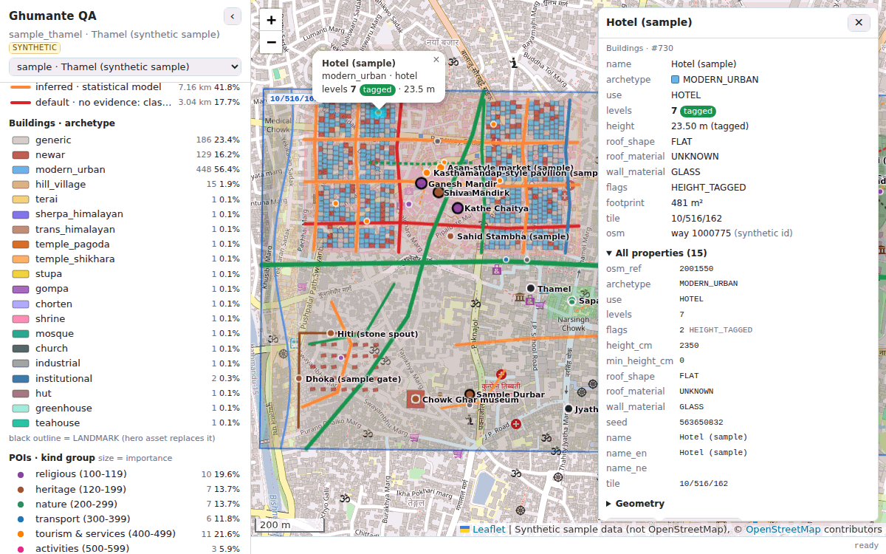

# Ghumante QA viewer

A developer-only web page for checking a region pack against reality (ARCHITECTURE.md §6.5). It overlays the layers that `build.py --qa` decodes **from the pack** (DATA_FORMATS.md §5) on OpenStreetMap. The overlays are roads and trails, buildings, areas, lines, POIs, hillshade and biome rasters, and the quadtree tile grid. Click anything to see every attribute, including which values were tagged and which were inferred.

It has no build step: `index.html`, `app.js` and `style.css`, plus Leaflet 1.9.4 from cdnjs (pinned with SRI).



## Quick start

```sh
python3 tools/qa-viewer/serve.py            # defaults: --root <repo root> --port 8765
```

`serve.py` serves the **repository root**, so the viewer can reach exports anywhere in the tree. On start it prints one URL per dataset it finds:

```
Serving /…/bookish-winner at http://localhost:8765/
QA viewer: http://localhost:8765/tools/qa-viewer/
  http://localhost:8765/tools/qa-viewer/?data=../../pipeline/build/regions/kathmandu_valley/qa   (kathmandu_valley)
  http://localhost:8765/tools/qa-viewer/?data=sample/qa   (synthetic sample)
```

| URL parameter | Meaning |
|---|---|
| `data=<dir>` | The QA export directory, the one holding `index.json`, **relative to the viewer page** (`tools/qa-viewer/`), or absolute from the server root (`/pipeline/…`). |
| `region=<id>` | Shorthand for `data=../../pipeline/build/regions/<id>/qa`. |
| *(neither)* | **Default:** the first pipeline export `serve.py` finds (`pipeline/build/regions/*/qa/`, then `pipeline/build/qa/*/` and `qa/*/`), otherwise the bundled synthetic sample `sample/qa`. With another static server (no listing endpoint), the default is the sample. |
| `index=<file>` | An index file other than `index.json` (the sample ships `index.tiled.json` and `index.minimal.json`). |
| `basemap=<url template>` | A self-hosted XYZ basemap (for example `https://tiles.example/{z}/{x}/{y}.png`). Combine with `basemap_attr=` and `basemap_maxzoom=`. |
| `bmin=<zoom>`, `bcap=<n>` | The buildings' lazy-load zoom (default 15) and the drawn-feature cap (default 30 000). |

`serve.py` options: `--root DIR`, `--port N` (0 picks a free port), `--host` (default `127.0.0.1`; it is not meant for a network), `--region ID` (also prints that region's URL), `--open`, `--quiet`.

It is standard library only. It also answers `GET /__qa/datasets.json`, the dataset list that feeds the viewer's dataset picker. Responses carry `Cache-Control: no-cache`, because the files change with every build.

## Data layout

The layout is normative per DATA_FORMATS.md §5. The viewer reads one directory:

```
<data>/index.json                          region bbox, tile list, layers, stats, biome palette
<data>/<layer>.geojson                     roads | trails | buildings | areas | lines | pois   (lon/lat, decoded FROM THE PACK)
<data>/hillshade/<L>/<tx>_<ty>.png         one per leaf detail tile (from HGHT)
<data>/biome/<L>/<tx>_<ty>.png             colour-coded BIOM
```

The pipeline writes it to `pipeline/build/regions/<region>/qa/`.

### What the viewer reads from `index.json`

Every field is optional. The viewer falls back as noted and tolerates the alternative spellings listed.

| Field | Use | Accepted forms / fallback |
|---|---|---|
| `region`, `name` | Header, title | `name` may be a string or `{en, ne}` |
| `bbox_lonlat` | Initial view | `[w, s, e, n]` or `{west, south, east, north}`; aliases `bbox`, `region_bbox`, `bounds`. Fallback: union of the tiles, then Kathmandu. |
| `tiles` | Tile grid, raster overlays, "tile listed?" checks | A list of `{level, tx, ty, key?, corners_lonlat?, bounds_lonlat?, hillshade?, biome?, counts?}`. `level`/`tx`/`ty` may also be `L`/`z`, `x`, `y`; an entry may be just the string `"10/516/162"`; `tiles` may be an object keyed by `"L/tx/ty"`. `key` should be a **string**, since a u64 exceeds 2^53. |
| `corners_lonlat` (per tile) | Exact quad, ordered `[sw, se, ne, nw]` | If absent, the viewer computes the corners from NPL-TM84 in JS when `scale_model` is missing or `"identity"` (M0/M1). It uses an axis-aligned `bounds_lonlat` only for another scale model. |
| `hillshade`, `biome` (per tile) | PNG path relative to `<data>` | `true` means `<kind>/<L>/<tx>_<ty>.png`; `null`/`false` means none. If **no** tile has these keys, the viewer assumes the default path for every leaf-level tile. |
| `leaf_level` | Grid default, tile readout, raster default | Falls back to `max(detail_levels)`, then the highest tile level, then 10. |
| `layers` | Which files to load | `{name: {path, count, tiles?, level?}}`, `{name: "file.geojson" \| count \| true}`, or `["roads", {name, file, count}]`. Without `layers`, the viewer tries the six spec layer names. A layer that is not listed is shown as "not in index" and never fetched. |
| `layers.<name>.tiles` | *Optional extension:* per-tile layer files | A template such as `"buildings/{L}/{tx}_{ty}.geojson"` (`{z}`/`{x}`/`{y}` also work; `true` means that default). The viewer then fetches only the tiles under the view. |
| `layers.places` | *Optional extension:* `places.geojson` | Point places (`kind` = PlaceKind) for search and labels. |
| `raster.{hillshade,biome}` | Pixel placement | `{registration: "vertex" \| "cell", row0: "north" \| "south"}`. Default: `row0` north. Registration is auto: an **odd** size (129, 65) means vertex-aligned samples on the tile edges, as in HGHT/BIOM; an even size means cell-aligned. |
| `biome_palette` | Biome legend; click a pixel to get its biome name | `{NAME: "#rrggbb"}`, `{id: …}`, `[{id \| name, color}]`; colours as hex, `[r, g, b]` or `rgb()`. Aliases: `palette.biome`, `palettes.biome`, `biome_colors`, `biomes`. Without it, the legend says so and the inspector shows raw pixel colours. |
| `stats` | Stats panel | Any JSON object, rendered as nested tables. |
| `attribution` | Map attribution | A string or a list. |
| `synthetic` | Badge; hides OSM links | `true` for test data. |

### What the viewer reads from the GeoJSON properties

Enum values may be **integers** (the raw pack values), **NAMES** (`"RESIDENTIAL"`), **lower_case** (`"living_street"`) or common OSM spellings (`paving_stones`→BRICK, `T3`→DEMANDING_MOUNTAIN_HIKING, `primary_link`→PRIMARY). Flags may be an int bitmask, a list of names, `"A|B"`, or booleans such as `oneway: true`. Unknown values are kept and drawn in **magenta** (`#ff00ff`), so they stand out.

Names come from `name` / `name_en` / `name_ne`, or `names: {default, en, ne}`. The OSM link is built from `osm_type` + `osm_id`, or from `osm_way_id` (roads, lines) or `osm_ref` (buildings and areas `>>1`, POIs `>>2`).

| Layer | Properties used (aliases) |
|---|---|
| roads, trails | `road_class` (`class`, `highway`), `surface`, `surface_source`, `sac_scale`, `flags` (RoadFlags), `lanes`, `width_cm`, `access` (Travel), `ref`, `tile` |
| buildings | `archetype`, `use`, `levels`, `flags` (BuildingFlags: `LEVELS_INFERRED`, `LANDMARK`, …; or `levels_source: "tagged"`), `height_cm`, `min_height_cm`, `roof_shape`, `roof_material`, `wall_material` |
| areas | `kind` (AreaKind), `flags` (bit0 clipped_by_tile) |
| lines | `kind` (LineKind), `flags` (bit0/1 context, bit2 intermittent, bit3 tunnel), `width_cm` |
| pois | `kind` (PoiKind, or PlaceKind + 1000), `importance` (0..255, or a 0..1 float), `flags` (PoiFlags), `ele_dm` |

The inspector shows **all** properties anyway, with integer enums decoded beside them.

**Context points.** ROAD and LINE pieces cut at a tile edge carry the original vertex just outside the tile (`HAS_PREV_CTX` / `HAS_NEXT_CTX`, DATA_FORMATS §1.4). Context points are never drawn. The viewer detects them geometrically: a flagged end vertex more than 5 cm outside the piece's tile square (from `tile`, else the leaf tile under the piece) is dropped. An exporter can therefore keep or strip them, and both work. The inspector lists the hidden points, and the stats panel counts them.

**Trails.** If the index has no `trails` layer, features of the trail classes in the roads file (pedestrian, footway, path, steps, cycleway, bridleway) are split into the Trails layer.

### For `qa_export.py`

The bundled sample (`sample/qa/`, generated by `sample/make_sample.py`) is a worked example of what the viewer handles best. Properties are named exactly like the `tile_format.py` records. `tile` is `"L/tx/ty"` on every feature. Enums are NAMES. Tiles carry `corners_lonlat` and an explicit raster path. `raster.*.registration` is stated, and `biome_palette` is included. Keep coordinates at 7 decimals (about 1 cm).

`index.minimal.json` is the opposite end: string tile ids, a bare layer list, trails mixed into roads, no palette. It shows what still works.

## Using it

* **Basemap:** OSM standard (tile.openstreetmap.org, "© OpenStreetMap contributors"), a custom basemap via `?basemap=`, or none, with an opacity slider. The page is low-volume and does no prefetching beyond Leaflet's defaults, in line with the [OSM tile usage policy](https://operations.osmfoundation.org/policies/tiles/). Switch to "None" for long sessions.
* **Layers:** Roads, Trails, Buildings, Areas, Lines, POIs, Places (if exported), Hillshade (multiplied over the basemap), Biome (pixelated, so no colour blending) and Tile grid (any listed level; a level with no listed tiles is computed and drawn dashed). Counts show the loaded and drawn features.
* **Road styling:**
  * *by surface_source*, **the key QA view** (tagged / derived / inferred / default), with a length-weighted bar;
  * *by surface*;
  * *by class* (colour, with width by class in every mode);
  * *by sac_scale* (trails; dashed means the value was inferred, `SAC_INFERRED`; roads are greyed).

  Trails are dashed in the other modes.
* **Building styling:** by archetype, by levels, or by levels tagged versus inferred. A black outline marks a `LANDMARK`, which a hero asset replaces in game.
* **Legend:** every entry shows its length or count over the loaded data. **Click an entry to hide that category.** For example, show only `default` surfaces.
* **Inspector:** click a feature (POIs, then lines, then buildings, then areas, nearest first) for a popup summary and a panel. The panel shows key fields with provenance pills, all raw properties, geometry, an OSM link, and the location: lat/lon, game x/z, leaf tile and u64 key, offset in the tile, **biome name under the cursor** (PNG pixel to palette) and hillshade value. Clicking empty map shows the location block alone. Escape closes the panel.
* **Search** (`/` focuses it): a client-side substring match over the names of loaded POIs, places, areas, buildings, lines and roads (in Latin or Devanagari; a road's tile pieces are merged into one result). It also accepts `w123456` / `n…` / `r…` / bare OSM ids, tile ids `10/516/162`, and `lat, lon` (or `lon, lat` in Nepal). Enter pans to the first result and selects it.
* **Shareable URL hash:** `#zoom/lat/lon/layers/options`, for example `#16/27.715500/85.310000/roads,trails,buildings,pois,grid/road=source&bldg=archetype&base=osm&base_op=80&hs_op=60&bio_op=55&grid=10`. The hash updates as you move, and pasting one applies it.
* **Status bar:** cursor lat/lon, game x/z, leaf tile and zoom; load progress in MB.

## Performance approach

Kathmandu has about 500 000 buildings. The viewer handles that volume as follows:

1. **Lazy buildings.** `buildings.geojson` is fetched only when the layer is on and zoom ≥ 15 (`?bmin=`). Other layers load at start, because search and stats need them. When the index lists **per-tile files** (`layers.buildings.tiles`), only the tiles under the view are fetched, at most 8 at a time. This is the better choice for valley-sized exports.
2. **Grid index.** After parsing, every feature's bbox goes into a uniform lon/lat grid. The cell size is fitted to about 64 features per cell, so a view query touches only the cells under the canvas.
3. **Batched canvas.** Each layer owns one `L.Canvas` subclass (Leaflet keeps the positioning, padding and zoom animation). On every move it draws the queried features **without creating a Leaflet object per feature**: Web Mercator is projected inline, and same-style features go into small `Path2D` batches of 64 polygons or 512 lines/points. Measured in headless Chromium 141, one huge path is super-linear (about 10 s for 40k polygons), per-feature paths take about 0.35 s, and 64-polygon chunks about 0.27 s. Clicks are hit-tested through the grid index (point distance, segment distance, point-in-polygon with holes), so no hidden interactive layers are needed.
4. **Caps.** Roads 60k, trails 40k, buildings 30k, areas and lines 20k, POIs 6k drawn at once. Roads and POIs are pre-sorted by class or importance, so a capped view keeps the important ones. Buildings keep those **nearest the view centre**, and the layer says "zoom in". Minor road classes appear from z13, minor POIs from z13 or z14 (landmarks always), POI labels from z16 and place labels from z12.

Measured with `tests/perf.cjs` on a synthetic valley (`tests/make_perf_dataset.py`: 500k buildings, 210 MB; 120k roads, 45 MB; 20k POIs; 1 248 tiles). The run used headless Chromium with **software** rasterisation on a busy 4-core container, at 1600×1000:

| | |
|---|---|
| Index ready | about 1.5 s |
| Roads load (45 MB) | 4 s |
| Buildings load + parse + index (210 MB) | 10–17 s |
| JS heap after load | about 450 MB |
| Pan at z16 in the densest core (30k buildings + 15k roads drawn) | about 0.25–0.3 s JS, about 1 s including software raster |
| Same pan at z17 | 0.12 s JS |
| Click hit test | 15–50 ms |
| First search (builds the name list) | 0.3–0.8 s |

A desktop Chrome with GPU raster is faster. If a full-valley `buildings.geojson` grows well beyond 200 MB, export per-tile files.

## Raster placement

A quadtree tile is a square in NPL-TM84, which makes it a slightly rotated quad in lon/lat: about 0.6° of grid convergence at Kathmandu, roughly 10 m across a 1 km tile. Each PNG is therefore placed with a CSS affine matrix computed from its NW, NE and SW corners, not an axis-aligned `L.imageOverlay`. With vertex registration, the centre of pixel (0, 0) sits exactly on the NW corner. The smoke test checks it to below 0.05 px, and the SE corner to below 0.6 px; the residual is the affine-from-three-corners approximation. The JS NPL-TM84 port (a Krüger series) agrees with pyproj to 0.02 mm over all of Nepal.

## Colour legends

Unknown or unexpected values are always magenta, `#ff00ff`.

**surface_source** (the key QA view)

| tagged | derived | inferred | default |
|---|---|---|---|
| `#1a9850` green: `surface=*` in OSM | `#2c7fb8` blue: from tracktype/smoothness | `#fd8d3c` orange: statistical model | `#d7191c` red: no evidence, class default |

**surface**

| asphalt | concrete | brick | cobble | gravel | compacted | dirt |
|---|---|---|---|---|---|---|
| `#3a3a3a` dark grey | `#b8b8b8` light grey | `#b5402f` brick red | `#7d6450` cobble brown | `#c9ad7f` tan | `#bdb76b` khaki | `#d2691e` orange-brown |

| mud | sand | grass | rock | snow/ice | wood | metal |
|---|---|---|---|---|---|---|
| `#4e2a12` dark brown | `#ecd540` yellow | `#4caf50` green | `#5d6d7e` slate | `#ffffff` white | `#a0522d` sienna | `#00a3a3` teal |

**class**: colour (and width in px at z16; widths apply in every mode, scaled by zoom)

| motorway | trunk | primary | secondary | tertiary | unclassified | residential | road |
|---|---|---|---|---|---|---|---|
| `#e8566e` 8 | `#f07e4a` 7 | `#f5a623` 6 | `#e3c91a` 5.5 | `#9cc93a` 5 | `#5fa8d3` 4 | `#7b8794` 4 | `#ff66cc` 4 |

| living_street | service | track | pedestrian | footway | path | steps | cycleway | bridleway |
|---|---|---|---|---|---|---|---|---|
| `#a984cf` 3.5 | `#a6a6a6` 3 | `#a67c52` 3 | `#c39bd3` 3.5 | `#fa8072` 2 | `#e06666` 2 | `#b30000` 2.5 | `#3b8bd9` 2 | `#6b8e23` 2 |

**sac_scale** (trails; dashed means inferred)

| T1 hiking | T2 mountain | T3 demanding mountain | T4 alpine | T5 demanding alpine | T6 difficult alpine | unknown |
|---|---|---|---|---|---|---|
| `#f2d600` | `#f39c12` | `#e74c3c` | `#b0005a` | `#6a1b9a` | `#111111` | `#9e9e9e` |

**Building archetype**

| generic | newar | modern_urban | hill_village | terai | sherpa_himalayan | trans_himalayan |
|---|---|---|---|---|---|---|
| `#bdbdbd` | `#c0392b` | `#5dade2` | `#d4a373` | `#e9c46a` | `#6c5ce7` | `#b08968` |

| temple_pagoda | temple_shikhara | stupa | gompa | chorten | shrine | mosque |
|---|---|---|---|---|---|---|
| `#d35400` | `#ff9f43` | `#f1c40f` | `#8e44ad` | `#a29bfe` | `#fd79a8` | `#16a085` |

| church | industrial | institutional | hut | greenhouse | teahouse |
|---|---|---|---|---|---|
| `#2c3e50` | `#7f8c8d` | `#2471a3` | `#8d6e63` | `#a8e6cf` | `#00b894` |

**Building levels**: 1 `#fde725` · 2 `#b5de2b` · 3 `#6ece58` · 4 `#35b779` · 5 `#1f9e89` · 6 `#26828e` · 7 `#31688e` · 8+ `#482878` (viridis). **Levels source**: tagged `#1a9850`, inferred `#fd8d3c`.

**POI kind groups** (circle size means importance; a black ring means LANDMARK)

| religious 100–119 | heritage 120–199 | nature 200–299 | transport 300–399 | tourism & services 400–499 | activities 500–599 | civic 600+ | places |
|---|---|---|---|---|---|---|---|
| `#8e44ad` | `#a0522d` | `#2e8b57` | `#1f78b4` | `#ff7f00` | `#e7298a` | `#636363` | `#111111` |

**Areas** (35% fill): water lake / river / pond `#4a90d9` / `#5b9bd5` / `#6aaee8` · glacier `#cfeeff` · wetland `#7fc6a4` · forest `#2d7a3a` · farmland `#e3dc8f` · orchard `#a8d08d` · meadow `#c5e8a5` · scrub `#9cbb6b` · park `#7bd17b` · residential `#d9c7b8` · commercial `#f2a5a5` · industrial `#c9b3d9` · religious `#d4a5d4` · pedestrian `#d6d6d6` · sand/shingle `#e8dcb0` · bare rock `#a9a9a9` · aerodrome `#c8c8e8` · cemetery `#9fbf9f` · military `#e6a0a0` · pitch `#8fd18f` · protected `#6b8e23` (dashed outline) · tea garden `#4f9a4f` · grassland `#bfe3a0` · scree `#b8b0a8`.

**Lines**: river `#2b6cb0` · stream `#4a90d9` · canal `#3fa7d6` · ditch `#7fb3d5` · railway `#444444` dashed · cable car / chair lift `#222222` / `#555555` dotted · zip line `#e7298a` dotted · runway / taxiway `#666666` / `#888888` · city wall `#8b4513` · mani wall `#6a1b9a` · waterfall `#00bcd4`. Intermittent lines are dashed; tunnels are dotted and faded.

**Biome**: from `index.json` `biome_palette`. The sample's palette is in `sample/make_sample.py`.

## Tests

```sh
python3 -m pytest tools/qa-viewer/tests -q             # sample conformance + determinism, serve.py
node tools/qa-viewer/tests/smoke.cjs                   # Playwright: 92 checks + screenshots/*.png (<300 KB)
node tools/qa-viewer/tests/smoke.cjs --offline         # never requests OSM tiles
python3 tools/qa-viewer/tests/make_perf_dataset.py && node tools/qa-viewer/tests/perf.cjs   # ~270 MB, gitignored
```

The smoke test drives the real page in headless Chromium against the sample. It covers:
- load and counts against `index.json`;
- raster placement and the projection against pyproj;
- every styling mode's colours, legend filtering and context-point stripping;
- inspector clicks (POI, building, road, raster sampling) and search (Latin, Devanagari, road pieces, tile ids, OSM ids);
- URL hash in and out (including `hashchange`), lazy buildings (no request below z15), per-tile building files and the minimal index;
- parsing tolerance (unit checks in the page) and a missing dataset or `?region=`;
- **no console errors**.

It resolves `playwright` from the global node modules (`NODE_PATH`). Behind an HTTPS-intercepting proxy whose CA Chromium does not trust, it serves the two external hosts, cdnjs and tile.openstreetmap.org, through Playwright's Node-side `route.fetch()`, which verifies TLS against `NODE_EXTRA_CA_CERTS`. TLS checks are never disabled, and the page still verifies Leaflet's SRI.

Screenshots: `screenshots/sample.png` (OSM basemap, surface_source, a building in the inspector), `sample-surface.png`, `sample-biome-sac.png`.

## Files

```
index.html  app.js  style.css      the viewer (Leaflet 1.9.4 from cdnjs with SRI)
serve.py                           static server for the repo root + /__qa/datasets.json
sample/make_sample.py              deterministic generator of sample/qa (needs pyproj + shapely)
sample/qa/                         synthetic two-tile Thamel export (+ index.tiled.json, index.minimal.json)
tests/                             smoke.cjs, perf.cjs, make_perf_dataset.py, proj_reference.py, test_*.py
screenshots/                       written by tests/smoke.cjs
```

The sample's streets, buildings and POIs are **invented**: they exercise every enum value and colour, and their OSM ids are fake. The neighbourhood names in `places.geojson` are real, at approximate positions.
